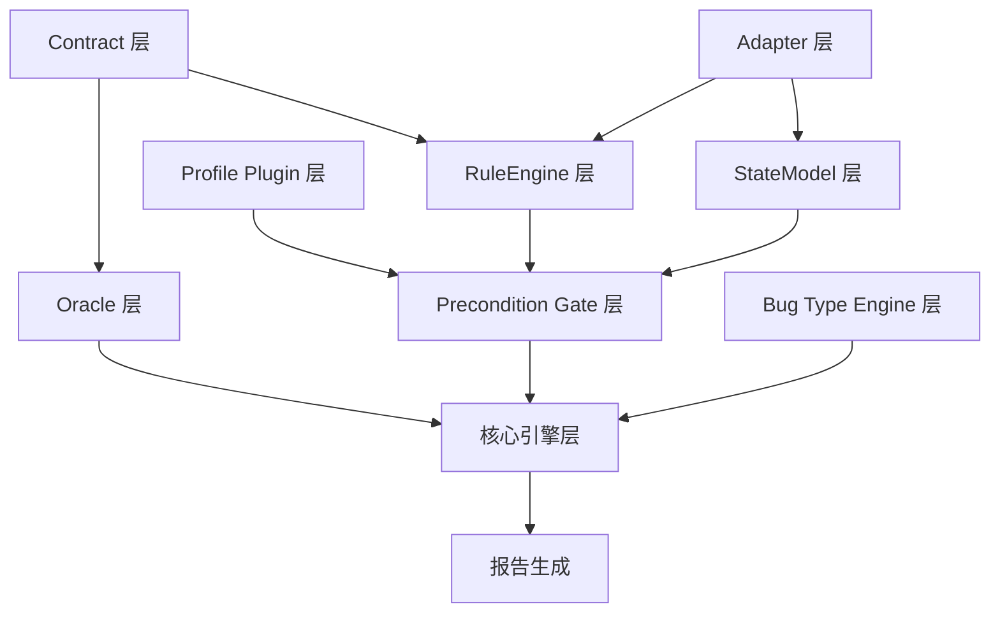

# 语义驱动的数据库 Bug 挖掘框架
## 架构冻结文档 v1.1

**冻结日期**: 2026-03-02
**版本**: v1.1 (DSL 增强版)
**状态**: 架构已冻结，可进入工程实现阶段

---

## 文档目录

```
docs/design/
├── 001-architecture-overview.md     # 本文件 - 架构总览
├── 002-contract-dsl-spec.md         # Contract DSL 规范
├── 003-data-models.md               # 核心数据模型
├── 004-execution-pipeline.md        # 执行流程规范
├── 005-interface-specs.md           # 接口规范
├── 006-bug-type-decision-table.md   # Bug 类型推导决策表
└── 007-three-valued-logic.md        # 三值逻辑系统
```

---

## 一、项目概述

### 1.1 核心定位

**语义驱动的数据库 Bug 挖掘框架**

- **主目标**: 数据库语义验证框架
- **支撑目标**: 自动化 fuzz 平台

### 1.2 设计原则

| 原则 | 说明 |
|------|------|
| **Contract 驱动** | 所有测试围绕语义契约展开 |
| **语义槽抽象** | 跨数据库通用，避免硬编码参数名 |
| **适配器隔离** | 数据库特定逻辑隔离在 Adapter 层 |
| **预条件门禁** | 确保 Type-3/4 的纯净度 |
| **三值逻辑** | 严格处理可评估/通过/失败 |
| **状态机验证** | 多粒度状态合法性检查 |
| **可解释性** | 每个决策都有清晰的追溯路径 |

---

## 二、四类 Bug 定义

| Type | 名称 | 判定条件 | 严重性 |
|------|------|----------|--------|
| **TYPE_1** | 非法操作成功 | `is_legal=False` 且 `status=SUCCESS` | HIGH |
| **TYPE_2** | 错误不可诊断 | `is_legal=False` 且 `status=FAILURE` 且 `!has_root_cause_slot` | MEDIUM |
| **TYPE_3** | 合法操作失败 | `is_legal=True` 且 `precondition_pass=True` 且 `status=FAILURE` | HIGH |
| **TYPE_4** | 语义违背 | `is_legal=True` 且 `precondition_pass=True` 且 `oracle_passed=False` | MEDIUM |

---

## 三、架构分层

```
┌─────────────────────────────────────────────────────────────────────────┐
│              语义驱动的 Bug 挖掘框架 (架构冻结版 v1.1)                   │
├─────────────────────────────────────────────────────────────────────────┤
│                                                                          │
│  ┌──────────────────────────────────────────────────────────────────┐   │
│  │                        Contract 层                               │   │
│  │  • 核心语义槽: 结构化 DSL (scope/depends_on/priority)             │   │
│  │  • 扩展语义槽: version_range + evidence                          │   │
│  │  ❌ 不允许 violation_type (由引擎推导)                            │   │
│  └───────────────────────────────────────────────────────────────────┘   │
│                                    ↓                                      │
│  ┌──────────────────────────────────────────────────────────────────┐   │
│  │                        Oracle 层 (第一类)                        │   │
│  │  • OracleDefinition: oracle_id/name/category/trigger/logic       │   │
│  │  • validation_logic 为 AST 结构                                   │   │
│  │  ❌ 不允许 violation_type (由引擎推导)                            │   │
│  └───────────────────────────────────────────────────────────────────┘   │
│                                    ↓                                      │
│  ┌──────────────────────────────────────────────────────────────────┐   │
│  │                        Adapter 层                               │   │
│  │  • get_capabilities() 唯一能力来源                                │   │
│  │  • map_slot_to_param() / transform_value() / classify_error()     │   │
│  └───────────────────────────────────────────────────────────────────┘   │
│                                    ↓                                      │
│  ┌──────────────────────────────────────────────────────────────────┐   │
│  │                    Profile Plugin 层                            │   │
│  │  • should_skip_test() / post_process_result()                    │   │
│  │  ❌ 不允许 get_capabilities() / Constraint                        │   │
│  └───────────────────────────────────────────────────────────────────┘   │
│                                    ↓                                      │
│  ┌──────────────────────────────────────────────────────────────────┐   │
│  │                      RuleEngine 层                               │   │
│  │  • evaluate_rules() - 三值逻辑评估                               │   │
│  │  • RuleCoverageTracker - Session 级隔离                          │   │
│  │  • ThreeValuedEvaluationTrace - 可解释性输出                      │   │
│  └───────────────────────────────────────────────────────────────────┘   │
│                                    ↓                                      │
│  ┌──────────────────────────────────────────────────────────────────┐   │
│  │                    Precondition Gate 层                         │   │
│  │  1. 消费 RuleEngine 结果                                         │   │
│  │  2. 检查 Profile skip 逻辑                                        │   │
│  │  3. StateModel 状态机合法性验证 (多粒度)                          │   │
│  │  ✅ 在 execute_test 之前执行                                      │   │
│  └───────────────────────────────────────────────────────────────────┘   │
│                                    ↓                                      │
│  ┌──────────────────────────────────────────────────────────────────┐   │
│  │                     Bug Type Engine 层                           │   │
│  │  • 根据上下文推导 Bug 类型                                       │   │
│  │  • ConfidenceFactors 预留扩展                                    │   │
│  └───────────────────────────────────────────────────────────────────┘   │
│                                    ↓                                      │
│  ┌──────────────────────────────────────────────────────────────────┐   │
│  │                        核心引擎层                                │   │
│  │  Case Generator → Triage → Confirmation → Oracle Checker        │   │
│  │  Evidence Collector → Report Generator                           │   │
│  └───────────────────────────────────────────────────────────────────┘   │
│                                                                          │
└─────────────────────────────────────────────────────────────────────────┘
```

---

## 四、执行流程

```
TestCase
    ↓
┌─────────────────────────────────────────────────────────────┐
│ Step 1: PreconditionGate (执行前检查)                      │
│  ✅ 检查 Contract 规则                                       │
│  ✅ 检查 Profile skip 逻辑                                   │
│  ✅ 检查 StateModel 状态合法性                               │
│  ✅ 全部通过 → 继续                                          │
│  ❌ 任一失败 → 返回 PRECONDITION_FAILED                      │
└─────────────────────────────────────────────────────────────┘
    ↓ (仅当预条件通过)
┌─────────────────────────────────────────────────────────────┐
│ Step 2: Adapter.execute_test (执行测试)                      │
│  ✅ 连接数据库                                               │
│  ✅ 执行操作                                                 │
│  ✅ 收集结果                                                 │
│  ✅ 分类错误                                                 │
└─────────────────────────────────────────────────────────────┘
    ↓
┌─────────────────────────────────────────────────────────────┐
│ Step 3: RuleEngine (规则评估)                                │
│  ✅ 评估所有语义槽规则                                       │
│  ✅ 生成覆盖统计                                             │
│  ✅ 返回 RuleEvaluationResult                                │
└─────────────────────────────────────────────────────────────┘
    ↓
┌─────────────────────────────────────────────────────────────┐
│ Step 4: BugTypeEngine (类型推导)                             │
│  ✅ 根据上下文推导 Bug 类型                                  │
│  ✅ 生成决策路径                                             │
│  ✅ 返回 BugTypeDerivation                                   │
└─────────────────────────────────────────────────────────────┘
    ↓
TestExecutionResult
```

---

## 五、关键设计决策

### 5.1 三值逻辑系统

- `False + anything → False`
- `True + None → True`
- `全部 None → None` (不可评估)
- 不允许 None 被隐式当作 True 或 False

### 5.2 异步状态稳定处理

- `wait_until_stable(scope, name, timeout)`
- 支持状态轮询、超时策略、稳定态判断
- `StabilityConfig.stable_predicate` 可插拔

### 5.3 Session 级隔离

- RuleEngine 在 Session 级实例化
- CoverageTracker 支持 `reset()` / `close()` / `snapshot()`

### 5.4 可解释性输出

- ThreeValuedEvaluationTrace 包含:
  - `final_result`
  - `false_sources`
  - `none_sources`
  - `evaluation_path`

---

## 六、模块依赖关系



---

## 七、MVP 裁剪方案

### Phase 1: 核心基础 (P0)
```
✅ 必须实现
├── Contract 层（核心语义槽 + 基础 DSL）
├── Adapter 层（接口定义 + SeekDB 实现）
├── RuleEngine 层（基础评估 + 三值逻辑）
├── Precondition Gate 层（基础检查）
├── StateModel 层（单粒度 COLLECTION）
├── Bug Type Engine 层（类型推导）
└── 核心引擎层（测试执行 + 基础报告）
```

### Phase 2: 语义验证 (P1)
```
⭐ 核心价值
├── Oracle 层（AST 结构 + 基础 Oracle）
├── Case Generator（Contract 驱动生成）
└── Evidence Collector（基础证据链）
```

### Phase 3: 增强能力 (P2)
```
🔧 工程完善
├── Contract 扩展语义槽
├── StateModel 多粒度 scope
├── 异步状态稳定处理
└── Session 级隔离
```

---

## 八、冻结清单

✅ Contract 层 - 结构化 DSL (scope/depends_on/priority)
✅ Oracle 层 - AST 验证逻辑
✅ Adapter 层 - Capabilities 唯一来源
✅ Profile Plugin 层 - Skip + Post-process
✅ RuleEngine 层 - 三值逻辑 + Session 隔离
✅ Precondition Gate 层 - 执行前检查 + StateModel
✅ StateModel 层 - 多粒度 scope + 异步稳定
✅ Bug Type Engine 层 - 置信度预留
✅ 核心引擎层 - 完整执行流程
✅ 三值逻辑系统 - 严格定义
✅ 可解释性输出 - EvaluationTrace
✅ 执行流程 - PreconditionGate 在 execute 之前

---

## 九、下一步

1. ✅ 架构设计完成
2. ✅ DSL 规范冻结 v1.1
3. ✅ 数据模型冻结
4. ✅ 接口规范冻结
5. ✅ 执行流程冻结
6. 📝 设计文档输出
7. 📋 实现计划制定
8. 🚀 Phase 1 编码

---

**架构正式冻结，可进入工程实现阶段**
