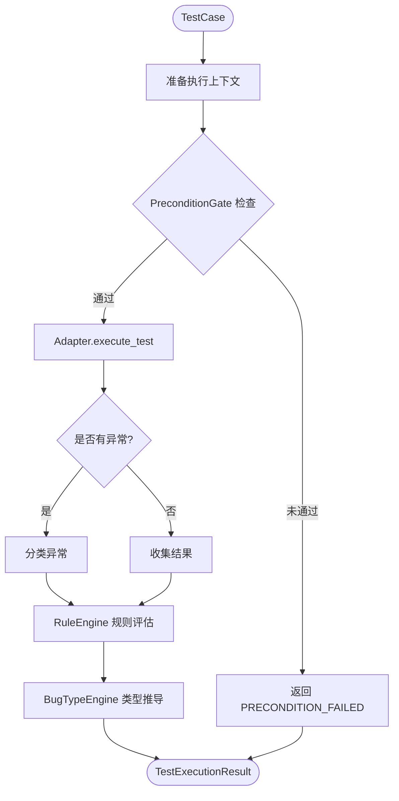

# 执行流程规范

**版本**: v1.1
**状态**: 冻结
**日期**: 2026-03-02

---

## 一、执行流程概述

```
TestCase → PreconditionGate → Adapter.execute_test → RuleEngine → BugTypeEngine → TestExecutionResult
```

**关键原则**:
- PreconditionGate **必须在** execute_test **之前**执行
- 预条件未通过时，不执行测试，直接返回 PRECONDITION_FAILED
- 避免统计污染和 Bug 类型推导错误

---

## 二、详细执行流程

```python
class ExecutionPipeline:
    """测试执行流水线"""

    def execute_test_case(self,
                         test_case: TestCase,
                         contract: Contract,
                         adapter: BaseAdapter,
                         profile: Optional[BaseProfilePlugin],
                         state_model: StateModel,
                         rule_engine: RuleEngine) -> TestExecutionResult:
        """
        执行单个测试用例的完整流程
        """

        # ================================================================
        # Step 0: 准备执行上下文
        # ================================================================
        execution_context = ExecutionContext(
            adapter=adapter,
            profile=profile,
            state_model=state_model,
            test_case=test_case
        )

        # ================================================================
        # Step 1: PreconditionGate (执行前检查)
        # ================================================================
        gate_result = self.precondition_gate.check(
            test_case=test_case,
            adapter=adapter,
            profile=profile
        )

        if not gate_result.passed:
            # 预条件未通过，不执行测试
            return TestExecutionResult(
                status=ExecutionStatus.PRECONDITION_FAILED,
                error=None,
                result_data=None,
                elapsed_seconds=0.0,
                gate_result=gate_result,
                rule_evaluation_result=None,
                bug_type_derivation=None
            )

        # ================================================================
        # Step 2: Adapter.execute_test (执行测试)
        # ================================================================
        start_time = datetime.now()

        try:
            execution_result = adapter.execute_test(test_case)
        except Exception as e:
            execution_result = ExecutionResult(
                status=self._classify_exception(e),
                error=e,
                result_data=None,
                elapsed_seconds=0.0
            )

        elapsed_seconds = (datetime.now() - start_time).total_seconds()

        # ================================================================
        # Step 3: RuleEngine (规则评估)
        # ================================================================
        rule_result = rule_engine.evaluate_rules(
            test_case=test_case,
            execution_context=execution_context
        )

        # ================================================================
        # Step 4: BugTypeEngine (类型推导)
        # ================================================================
        bug_type_derivation = self.bug_type_engine.derive_bug_type(
            test_case=test_case,
            rule_result=rule_result,
            execution_result=execution_result,
            error_has_root_cause=self._has_root_cause_slot(execution_result.error),
            precondition_passed=gate_result.passed
        )

        return TestExecutionResult(
            status=execution_result.status,
            error=execution_result.error,
            result_data=execution_result.result_data,
            elapsed_seconds=elapsed_seconds,
            gate_result=gate_result,
            rule_evaluation_result=rule_result,
            bug_type_derivation=bug_type_derivation
        )
```

---

## 三、PreconditionGate 检查流程

```python
class PreconditionGate:
    """预条件门禁"""

    def check(self,
              test_case: TestCase,
              adapter: BaseAdapter,
              profile: Optional[BaseProfilePlugin]) -> GateResult:
        """检查测试用例是否通过预条件"""

        # 1. RuleEngine 规则评估
        rule_result = self.rule_engine.evaluate_rules(
            test_case,
            ExecutionContext(adapter=adapter, profile=profile, ...)
        )

        if not rule_result.overall_passed:
            for slot_result in rule_result.results:
                for single_rule in slot_result.results:
                    if single_rule.passed == False:
                        return GateResult(
                            passed=False,
                            reason=f"rule_violation: {slot_result.slot_name}.{single_rule.rule_id}"
                        )

        # 2. Profile skip 逻辑
        if profile:
            skip_reason = profile.should_skip_test(test_case)
            if skip_reason:
                return GateResult(
                    passed=False,
                    reason=f"profile_skip: {skip_reason}"
                )

        # 3. StateModel 状态机合法性
        state_result = self._check_state_machine_legality(test_case, adapter)
        if not state_result.passed:
            return GateResult(
                passed=False,
                reason=f"state_violation: {state_result.reason}"
            )

        return GateResult(
            passed=True,
            reason="all_checks_passed",
            coverage_report=rule_result.coverage_report
        )
```

---

## 四、执行流程图



---

## 五、状态转换表

| 当前状态 | 触发条件 | 下一状态 | 说明 |
|----------|----------|----------|------|
| TestCase | 准备上下文 | ExecutionContext | 创建执行上下文 |
| ExecutionContext | PreconditionGate 检查 | GateResult | 预条件检查 |
| GateResult | passed=False | PRECONDITION_FAILED | 预条件失败，不执行 |
| GateResult | passed=True | execute_test | 继续执行 |
| TestCase | execute_test | ExecutionResult | 执行测试 |
| Exception | 分类 | ExecutionResult | 异常分类 |
| ExecutionResult | 完成 | RuleEvaluationResult | 规则评估 |
| RuleEvaluationResult | 完成 | BugTypeDerivation | 类型推导 |
| BugTypeDerivation | 完成 | TestExecutionResult | 最终结果 |

---

## 六、异常分类规则

```python
def _classify_exception(self, error: Exception) -> ExecutionStatus:
    """分类异常为执行状态"""

    if isinstance(error, TimeoutError):
        return ExecutionStatus.TIMEOUT

    if isinstance(error, ConnectionError):
        return ExecutionStatus.CRASH

    if isinstance(error, MemoryError):
        return ExecutionStatus.CRASH

    # 其他异常视为 FAILURE
    return ExecutionStatus.FAILURE
```

---

## 七、时间戳记录

每个阶段都记录时间戳：

```python
@dataclass
class ExecutionTimestamps:
    """执行时间戳"""
    created_at: datetime                    # TestCase 创建时间
    context_created_at: datetime            # ExecutionContext 创建时间
    gate_checked_at: datetime               # Gate 检查时间
    test_started_at: datetime               # 测试开始时间
    test_completed_at: datetime             # 测试完成时间
    rule_evaluated_at: datetime             # 规则评估时间
    bug_derived_at: datetime                # Bug 推导时间
```

---

## 八、错误处理规范

| 阶段 | 错误类型 | 处理方式 |
|------|----------|----------|
| PreconditionGate | 规则违反 | 返回 PRECONDITION_FAILED，不执行 |
| PreconditionGate | 状态机错误 | 返回 PRECONDITION_FAILED，记录原因 |
| execute_test | 超时 | 分类为 TIMEOUT，继续 RuleEngine |
| execute_test | 崩溃 | 分类为 CRASH，继续 RuleEngine |
| execute_test | 其他异常 | 分类为 FAILURE，继续 RuleEngine |
| RuleEngine | 评估错误 | 记录为 None，继续 BugTypeEngine |
| BugTypeEngine | 推导错误 | 记录 confidence=0，继续 |
